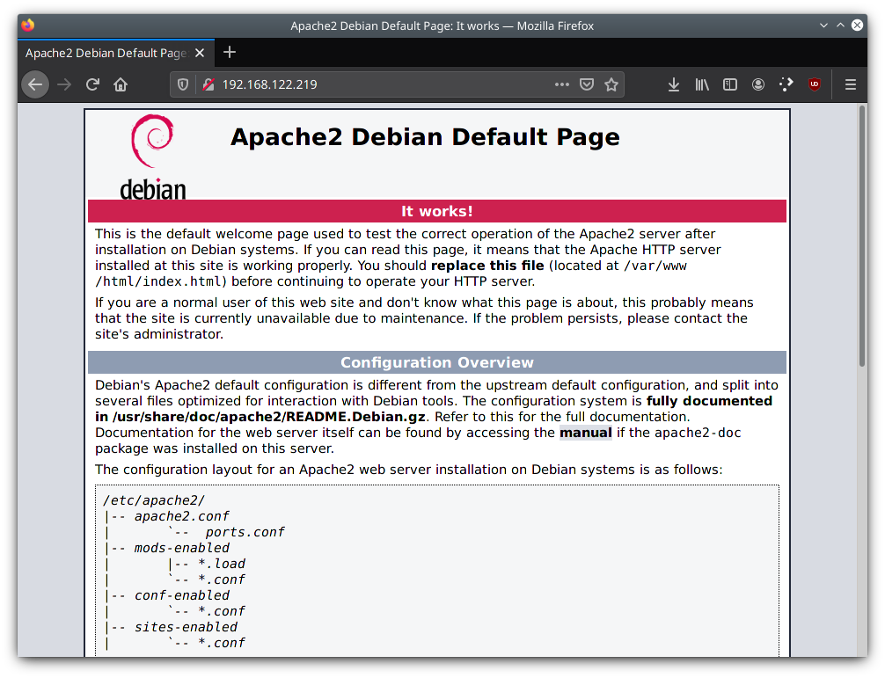

# Installation d'un serveur LAMP Debian

### LAMP = Linux Apache MariaDB PHP

  - [Installer Apache 2](#installer-apache-2)
  - [Installer MariaDB](#installer-mariadb)
- [Installation d'un serveur LAMP Debian](#installation-dun-serveur-lamp-debian)
    - [LAMP = Linux Apache MariaDB PHP](#lamp--linux-apache-mariadb-php)
  - [Installer Apache 2](#installer-apache-2)
  - [Installer MariaDB](#installer-mariadb)
- [Installer PHP](#installer-php)
- [Tester PHP sur Apache](#tester-php-sur-apache)

## Installer Apache 2
`# apt install apache2`

Vérifier si le service Apache est en train de tourner:  
`# systemctl status apache2`

Sur un navigateur web, essayer de charger la page en utilisant l'IP du serveur.

## Installer MariaDB

`# apt install mariadb-server`

Pour s'assurer de la sécurité:  
`# mysql_secure_installation`

Créer un utilisateur et une base de données:
Se connecter à mysql en tant que root:  
`# mysql -u root -p`

    MariaDB [(none)]> CREATE DATABASE base_test;
    MariaDB [(none)]> GRANT ALL ON base_test.* TO 'antoine'@'localhost' IDENTIFIED BY 'password' WITH GRANT OPTION;
    MariaDB [(none)]> FLUSH PRIVILEGES;
    MariaDB [(none)]> exit;

Véfier si l'utilisateur peut se logger et voir la base de données:

    # mysql -u antoine -p
    MariaDB [(none)]> SHOW DATABASES;

# Installer PHP

`# apt install php libapache2-mod-php php-mysql`

Redémarrer Apache:  
`# systemctl reload apache2`  
`# systemctl status apache2`

# Tester PHP sur Apache

`# nano /var/www/html/info.php`

Charger la page sur un navigateur:  
`http://SERVER_IP/info.php`

Enfin, supprimer le fichier par sécurité:  
`# rm /var/www/html/info.php`